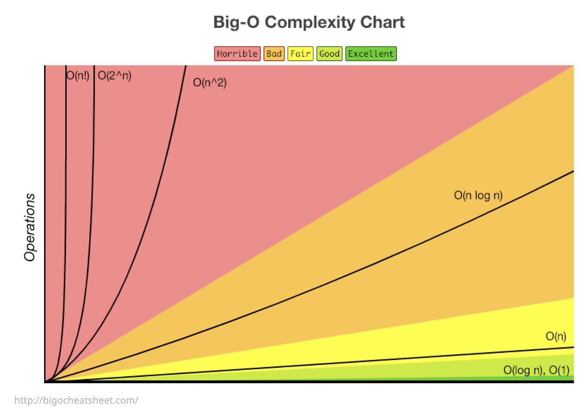
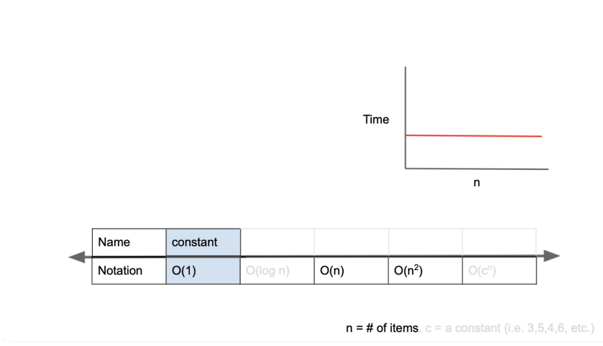
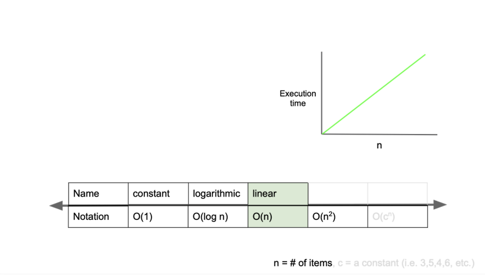
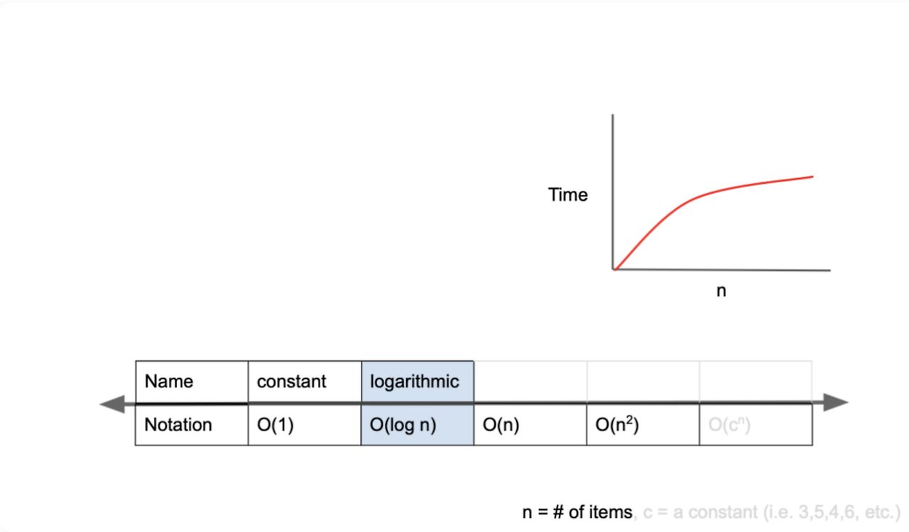
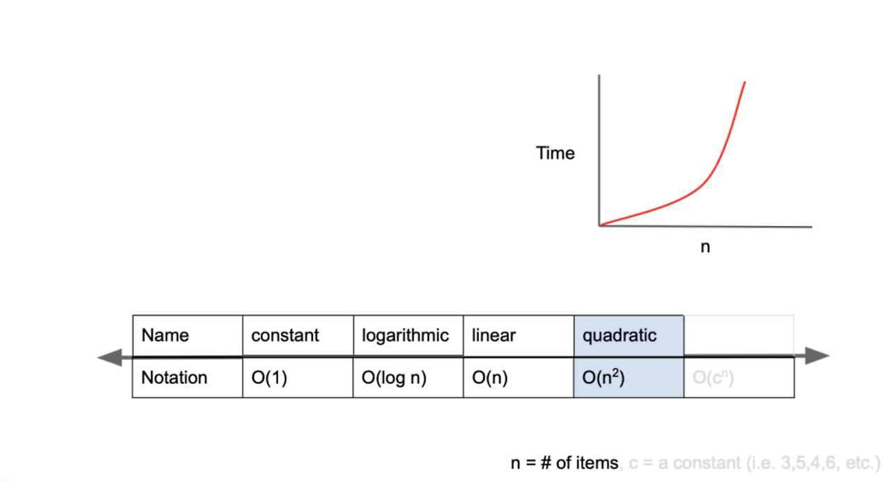
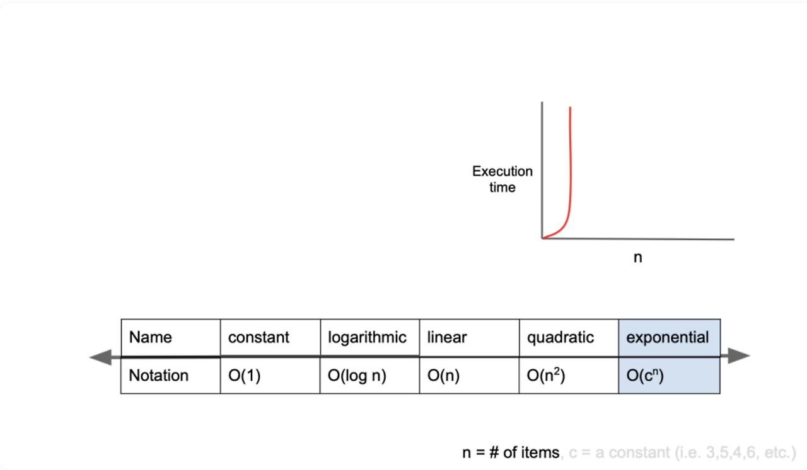

<div style="font-size:32px; font-weight: 800; border-left: 7px solid #0687f0; padding-left:15px !important; color:#000000; margin-bottom:15px;">[알고리즘] 시간 복잡도</div>

{: .no_toc }

<details open markdown="block">
  <summary>
    Table of contents
  </summary>
  {: .text-delta }
1. TOC
{:toc}
</details>

---

# **시간 복잡도?(Time Complexity)**

다음은 1부터 N까지의 합을 구하는 코드이다.
```C++
int sum = 0;
for(int i=1; i<=N; i++)
  sum += i;
-----------------------------------------
int sum = (N+1)*N/2;
```


위 코드와 아래 코드 중 어떤 코드가 더 효율적일까?

보기만 해도 아래 코드임을 알 수 있다. 왜냐하면 반복문을 N회 돌려 N번의 수행을 하는 것보다, 한 번의 계산으로 1번 수행을 하는 것이 빠른 것이 당연하기 때문이다. 

이와 관련된 것이 "**시간복잡도"**이다. 


#### 문제를 풀 때 시간복잡도를 고려한다는 것?

알고리즘을 풀 때는 해당 문제에 대한 해답을 구하는 것도 중요하지만, '얼마나 효율적으로 문제를 해결했냐'도 그에 못지않게 중요하다. 

효율적인 해결 방법을 고민한다는 것 -> 시간복잡도를 고려한다는 것이다!

<center><h4><strong>즉 알고리즘의 로직을 코드로 구현할 때, 시간 복잡도를 고려한다는 것은 "입력값의 변화에 따라 연산을 실행할 때,</strong></h4></center>

<center><h4><strong>"연산 횟수에 비해 시간이 얼마만큼 걸리는가?"라는 말이다.</strong></h4></center>


# 시간복잡도 표기법

시간 복잡도를 표현하는 방법에는 3가지가 있다. 

*   최적의 경우: 오메가 표기법(Big-Ω notation)
*   평균적인 경우: 세타 표기법(Big-Θ notation)
*   최악의 경우: 빅오 표기법(Big-O notation)


## Big-O 표기법

시간 복잡도를 표기하는 방법 중 가장 자주 사용되는 표기법

\-> 빅오 표기법은 최악의 경우를 고려하므로 프로그램이 실행되는 과정에서 소요되는 최악의 시간까지 고려할 수 있다.

**최악의 시간까지 고려해야 하는 이유는?**

만약 알고리즘의 수행시간이 평균적으로 2분이 걸린다고 판단했는데, 만약 실제로 걸린 시간이 1시간이 훌쩍 넘었다면?

→ 평균적인 경우만 고려했으니, 어디에서 문제가 발생했는지 알아내기 위해서는 로직의 많은 부분을 파악해야 한다.

위와 같이 최악의 경우가 발생하지 않기를 바라며 시간을 계산하는 것보다는, ‘**최악의 경우도 고려하여 대비’** 하는 것이 바람직하다.


## Big-O 표기법의 종류



#### **O(1)**



일정한 복잡도(constant complexity)라고 하며 입력값이 증가하더라도 시간은 일정함

즉, 입력 값에 상관 없이 동일한 수행 시간이 걸린다. 
```C++
int O_1_algorithm(arr, index) {
    return arr[index];
}
    
int arr[5] = [1, 2, 3, 4, 5];
int index = 1;
int result = O_1_algorithm(arr, index);
cout << result; // 2
```
이 함수는 특정 배열의 특정 인덱스값을 반환하는 함수이다. 배열의 크기가 아무리 커져도, 특졍 인덱스 하나만을 참조하므로 수행시간은 동일하다. 


#### **O(n)**



O(n)은 선형 복잡도(linear complexity)라고 부르며, 입력값이 증가함에 따라 수행 시간도 같은 비율로 증가한다. 
```C++
function O_n_algorithm(n) { 
  for (let i = 0; i < n; i++) {
    // do something for 1 second
  }
}
    
function another_O_n_algorithm(n) {
  for (let i = 0; i < 2n; i++) {
    // do something for 1 second
  }
}
```
0\_n\_algorithm → n값이 1 증가할 때마다 1초씩 증가

another\_0\_n\_algorithm → n값이 1 증가할 때마다 2초씩 증가

**그럼 위 함수는 O(n)이고, 아래 함수는 O(2n)이라고 할 수 있나?? → NO!!!** 모두 O(n)이다.

Big-O 표기법은 알고리즘의 실행 시간이 입력 크기에 비해 어떻게 증가하는지를 나타내는 데 사용된다.

예를 들어 O(n)과 O(2n) 모두 선형적으로 증가하기 때문에 성장률의 관점에서는 이 알고리즘이 n값의 변화에 따라 어떻게 증가하는지는 변하지 않는다. 따라서 시간복잡도는 모두 O(n)으로 표현할 수 있다!


#### **O(log n)**



로그복잡도라고 부르며, Big-O 표기법 중 O(1) 다음으로 빠른 시간 복잡도를 갖는다. 

ex) 이진 탐색


#### **O(n^2)**



2차 복잡도라고 부르며 입력값이 증가함에 따라 n의 제곱수의 비율로 증가한다. 

```C++
    function O_quadratic_algorithm(n) {
      for (let i = 0; i < n; i++) {
        for (let j = 0; j < n; j++) {
          // do something for 1 second
        }
      }
    }
    
    function another_O_quadratic_algorithm(n) {
      for (let i = 0; i < n; i++) {
        for (let j = 0; j < n; j++) {
          for (let k = 0; k < n; k++) {
            // do something for 1 second
          }
        }
      }
    }
```
위 함수의 시간복잡도는 O(n^2), 아래 함수는 O(n^3)라고 할 수 있다. 


#### **O(2^n)**



기하급수적 복잡도(exponential complexity)라고 부르며, Big-O 표기법 중 가장 느린 시간복잡도를 가진다. 

구현한 알고리즘의 시간복잡도가 기하급수적 복잡도이면 다른 접근 방식을 고려하는 것이 좋다. 

ex) 피보나치 수열
```C++
function fibonacci(n) {
  if (n <= 1) {
    return 1;
  }
  return fibonacci(n - 1) + fibonacci(n - 2);
}
```
